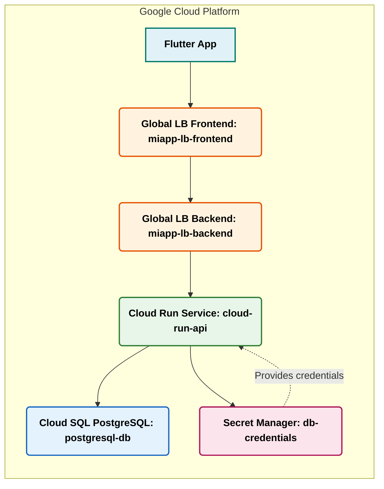

# Arquitectura de Aplicación Flutter con API REST en Google Cloud

Este documento describe la arquitectura de backend desplegada en Google Cloud para una aplicación Flutter exclusiva de Android que consume una API RESTful que sirve datos en formato JSON.
<!-- ## Diagrama de Arquitectura -->

## Componentes de la Arquitectura

### 1. Global Load Balancer (Frontend) - `miapp-lb-frontend`

*   **Descripción:** Este componente es el punto de entrada público y el terminador SSL/TLS para el dominio personalizado de tu aplicación. Es un balanceador de carga global de Google Cloud.
*   **Características:**
    *   **Dominio Personalizado:** Permite que tu API sea accesible a través de tu propio dominio (ej. `https://miapp.miempresa.com`).
    *   **HTTPS/SSL Gestionado:** Termina el tráfico HTTPS, gestionando automáticamente los certificados SSL para tu dominio, lo que garantiza una comunicación segura entre tu aplicación Flutter y el backend.
    *   **Redirección HTTPS:** Configurado para redirigir automáticamente todo el tráfico HTTP a HTTPS, forzando conexiones seguras.
*   **Función Principal:** Recibir todas las solicitudes entrantes de tu aplicación Flutter, gestionar la seguridad de la capa de transporte (HTTPS) y dirigirlas al backend adecuado.

### 2. Global Load Balancer (Backend) - `miapp-lb-backend`

*   **Descripción:** Este componente actúa como un servicio backend para el Global Load Balancer Frontend, definiendo cómo se enruta el tráfico hacia tu servicio de Cloud Run.
*   **Características:**
    *   **Mapeo de Rutas:** Configurado para dirigir específicamente las solicitudes que coinciden con el patrón de ruta `/api/*` (ej. `https://miapp.miempresa.com/api/modulo/use-case`) hacia tu servicio de Cloud Run.
*   **Función Principal:** Enrutar de forma inteligente las solicitudes del dominio personalizado al servicio de Cloud Run que aloja tu API REST.

### 3. Cloud Run (Service) - `cloud-run-api`

*   **Descripción:** Este servicio completamente administrado aloja tu API REST desarrollada en Dart/Shelf.
*   **Características:**
    *   **Escalabilidad Automática:** Escala horizontalmente de cero a miles de instancias según la demanda, y escala de nuevo a cero cuando no hay tráfico, optimizando costos.
    *   **Sin Servidores (Serverless):** No necesitas gestionar infraestructura subyacente, parches o mantenimiento.
    *   **Acceso Público:** Configurado para permitir la invocación pública, lo que significa que el balanceador de carga y, por ende, tu aplicación Flutter, pueden acceder a él.
    *   **Contenedorizado:** Despliega tu aplicación como un contenedor Docker, proporcionando consistencia entre entornos.
*   **Función Principal:** Ejecutar tu lógica de negocio de la API en Dart/Shelf, procesar las solicitudes de datos JSON de la aplicación Flutter y comunicarse con la base de datos.

### 4. Cloud SQL (PostgreSQL) - `postgresql-db`

*   **Descripción:** Es un servicio de base de datos relacional completamente administrado que aloja tu base de datos PostgreSQL versión 16.
*   **Características:**
    *   **Administrado:** Google Cloud se encarga de la replicación, parches, actualizaciones, copias de seguridad y alta disponibilidad.
    *   **Escalabilidad:** Permite escalar fácilmente la CPU, la memoria y el almacenamiento según las necesidades de tu aplicación.
    *   **Seguridad:** Ofrece cifrado de datos en reposo y en tránsito, además de opciones de control de acceso.
*   **Función Principal:** Almacenar, gestionar y proporcionar acceso a los datos de tu aplicación de manera fiable y performante para tu API.

### 5. Secret Manager - `db-credentials`

*   **Descripción:** Un servicio seguro para almacenar, gestionar y acceder a secretos sensibles, como claves API, contraseñas y certificados.
*   **Características:**
    *   **Almacenamiento Seguro:** Mantiene tus secretos cifrados y protegidos de accesos no autorizados.
    *   **Control de Versiones:** Permite mantener un historial de tus secretos y revertir a versiones anteriores si es necesario.
    *   **Integración con IAM:** Permite definir quién puede acceder a qué secretos usando la Gestión de Identidades y Accesos (IAM) de Google Cloud.
*   **Función Principal:** Almacenar de forma segura las credenciales (nombre de usuario y contraseña) necesarias para que tu servicio de Cloud Run se conecte a la instancia de Cloud SQL, evitando que estos datos sensibles estén expuestos en el código o en configuraciones no seguras.
